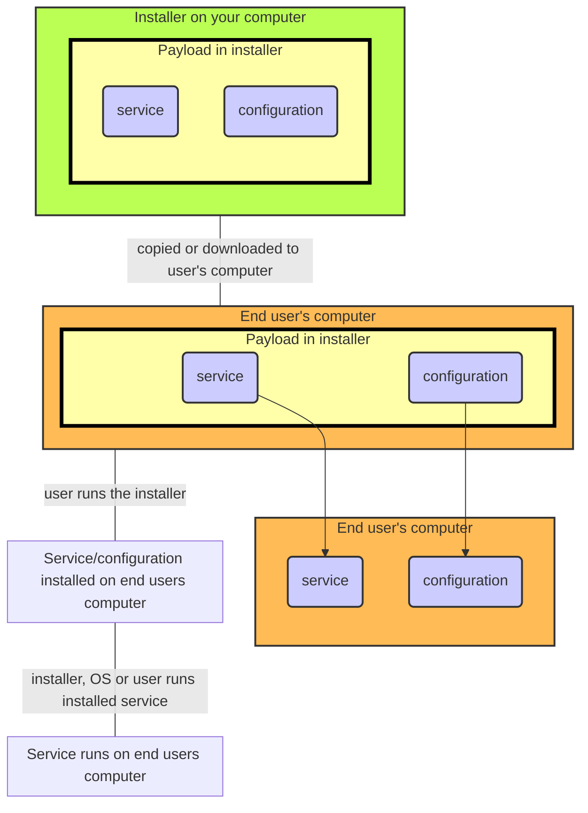

# mac_installer

About this project
------------------

This project builds an installer for macOS. 
The resulting installer can be distributed outside Apple's App Store.
It can install system-level services and their associated configuration files.

When the installer is copied onto the setination computer and run, the user will be asked to provide administrator credentials so that the installer can run with full access, which it needs in order to copy files to system directories and install services.

Other scenarios, such as installing user-level services and applications, are planned but not fully supported yet.

Overview
--------

The **installer** contains a **payload**, which consists of a set of files (typically, executables and their associate preferences and configuration files) together with **metadata** telling the installer what the files are and the locations they should be copied to when the installer is run.

The installer itself consists of two parts, the **installer app** that provides the UI that the user sees and a **helper service** that runs as root and is used to unpack, install and set owner and permissions on the files being installed. The installer app itself must be **signed** and **notarized** so that it can be distributed outside of Apple's App Store.

The **services** in the payload will need to have specific owner/group/permission settings in order to be run successfully once installed. The helper service checks for these settings whenever it works with the files in the payload. For more details, see https://developer.apple.com/library/archive/documentation/MacOSX/Conceptual/BPSystemStartup/Chapters/Introduction.html

The services in the payload will need to be signed and notarized as well.

Adapting the installer for your own use
---------------------------------------

In order to customize this project for your own needs
- the payload needs to be updated to include the software you want to install
- the installer app itself needs to be built with your own bundle ID (_com.yourdomain.yourappname_)
- the helper service it uses during installation also needs to have its bundle ID changed to one that you own. Usually, this is the app's bundle ID with 'helper' appended to it, e.g., _com.yourdomain.yourappnamehelper_
- in order for the installer to be distributed outside the App Store, it needs to be notarized using your developer credentials. If this step is skipped, the installer will appear to build, but running it will bring up a message saying that it could not be checked for malicious software; depending on the version of macOS, it might be blocked from running.

**AdjustProjectSettings.zsh** updates the Xcode project and the source tree with your
bundle IDs for the installer application and the helper service and adds your developer credentials to the notarization step.
Once you run AdjustProjectSettings.zsh, you should check in the updated sources.
You only need to perform this step once.

In order to support notarization, you will need to use your Apple ID to create an 'app-specific
password' that is stored in the keychain of your build machine and used to perform the notarization
step. If you have already done this for some other project, you do not need to repeat this step.
See https://support.apple.com/en-us/102654 for details on how to set this up.

The next step is to replace the sample software payload with the software you want installed.
The installer will only install files if they are in the Payload/ directory, and you should replace
everything in Payload/ with your own software.

The file **Payload/PayloadMetadata.plist** is used by the installer to tell it what the files in Payload/ are and how they are to be handled. There is a script which will generate it from scratch which you
should customize to describe your specific payload: **SetupPayloadMetadata.zsh**.

The example payload is a small system service that writes out the date and name of the
currently logged-in user to /var/log/product.log.
If you build the installer and run it, then log out (but not shut down), when you log back in
/var/log/product.log will have been updated to show that no-one was logged in. This
demonstrates that the service was still running even when the login window was being shown
and no one was logged in.

# What can the installer install?

- System services
- Per-user services
- (Coming soon) Applications
- Configuration/support files

Every file installed by the installer has an intended owner:group and set of permissions specified
in the payload metadata. The installer ensures that the file is copied to its intended
destination with the correct permissions and that its owner and group match.

Depending on what is being installed, the owner:group and permissions may need to be exactly what the
OS expects. Services will not launch if they have the wrong owner/permission settings, for instance.
 
**System services** (daemons) are started when the OS starts, and are running independently of
whether a user is logged in to the computer or not. They can run with elevated (root)
privileges, and do not have access to a window manager or UI (i.e., no desktop and no
windows). They are usually installed into /Library/LaunchDaemons, but the example code
installs the service into /Library/PrivilegedHelperTools just to show that it can be done.

**User services** (agents) can be launched when a user is logged in, and have access to the
UI that each specific user sees. If multiple users are logged in at the same time,
there each user can run their own separate copy of the user service if it is installed
into ~/Library/LaunchAgents, or they can share a single copy if it is installed into
/Library/LaunchAgents.

Configuration/support files are simply copied to their destination folder when the installer is run.

(Work in progress) Applications (.app) files are folders with a well-defined structure. To include an app
folder in the installer's payload, copy the app to the Payload/ directory.

(Work in progress) The .app folder can also be archived and the installer will unarchive it during installation.
This is to reduce the size of the final installer.

# Customizing the installer with additional steps

(Work in progress) Developers who use this project as a basis for their own installers may want to
add additional steps to the installer flow. For instance, the end-user might need to be prompted for
credentials which would need to be submitted to an API endpoint.

In order to support this, there needs to be some way to enhance the project with custom panes and code specific to
those panes. This doesn't appear to be possible yet with SwiftUI in a way that's as convenient as I'd like.
Work is underway to see if replacing SwiftUI with another approach has the potential to make customization easier.

# Implementation

The installer uses a system 'helper' daemon at run time to perform actions which
require elevated privileges. The helper daemon is embedded within the installer app,
and macOS takes care of prompting the user for admin credentials before allowing the
helper daemon to be run and invoked.

[Installer UI] (runs as user)
(handles user interaction)

invokes

[helper service] (runs as root)
(handles actions requiring root access)
  
An installer needs to do several things in order to be able to handle installing
a system-level service. All actions involving daemons require root access.
- detect whether a service is running
- start and stop a service
- copy the service executables to the appropriate destination directory
- copy configuration files for any installed services to the
appropriate system-level or user-level directories.

